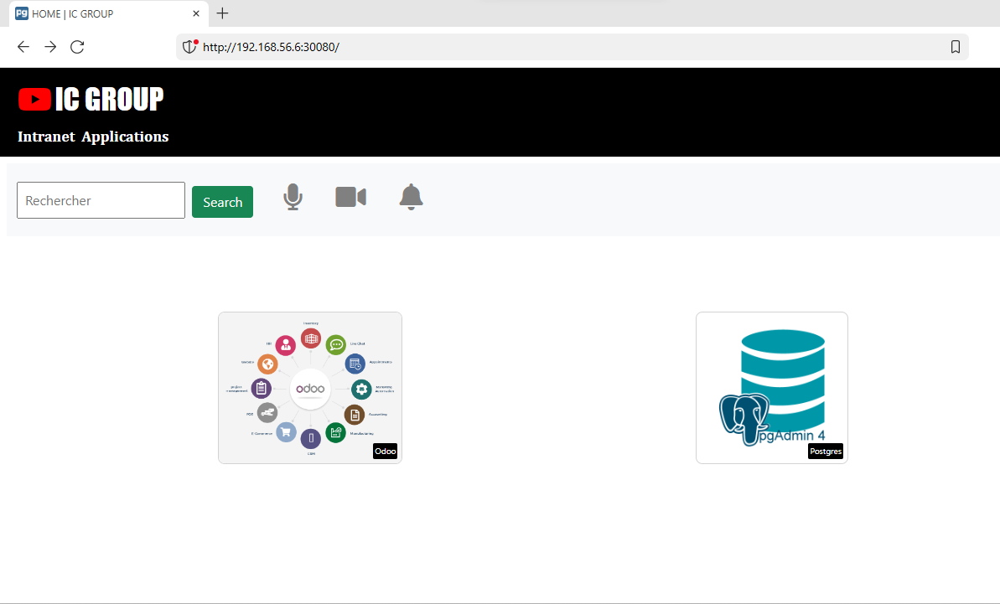

Prénom: Abdoul Gadirou

Nom: DIALLO

Promotion: BootCamp DevOps 17

# Projet Final 

# 1 - Application :ic-webapp

La société **IC GROUP** dans laquelle vous travaillez en tant qu’ingénieur Devops souhaite mettre sur pied un site web vitrine devant permettre d’accéder à ses 02 applications phares qui sont :  

1) Odoo et 
1) pgAdmin 

**Odoo**, un ERP multi usage qui permet de gérer les ventes, les achats, la comptabilité, l’inventaire, le personnel …  

Odoo est distribué en version communautaire et Enterprise. ICGROUP souhaite avoir la main sur le code et apporter ses propres modifications et customisations ainsi elle a opté pour l’édition communautaire.  Plusieurs versions de Odoo sont disponibles et celle retenue est la 13.0 car elle intègre un système de LMS (Learning Management System) qui sera utilisé pour publier les formations en internes et ainsi diffuser plus facilement l’information.  

Liens utiles : 

- Site officiel :[ https://www.odoo.com/ ](https://www.odoo.com/) 
- GitHub officiel:[ https://github.com/odoo/odoo.git ](https://github.com/odoo/odoo.git) 
- Docker Hub officiel :[ https://hub.docker.com/_/odoo ](https://hub.docker.com/_/odoo) 

**pgAdmin** quant à elle devra être utilisée pour administrer de façon graphique la base de données PostgreSQL crée précédemment. 

- Site officiel :[ https://www.pgadmin.org/ ](https://www.pgadmin.org/) 
- Docker Hub officiel:[ https://hub.docker.com/r/dpage/pgadmin4/ ](https://hub.docker.com/r/dpage/pgadmin4/) 

Le site web vitrine a été conçu par l’équipe de développeurs de l’entreprise et les fichiers y relatifs se trouvent dans le repo suscité : [ https://github.com/eazytraining/projet-fils-rouge.git ](https://github.com/eazytraining/projet-fils-rouge.git) . Il est de votre responsabilité de conteneuriser cette application tout en permettant la saisie des différentes URL des applications (Odoo et pgadmin) par le biais des variables d’environnement. 

Ci-dessous un aperçu du site vitrine attendu. 


**NB :** L’image** créée devra permettre de lancer un container permettant d’héberger ce site web et ayant les liens adéquats permettant d’accéder à nos applications internes 


# 2 - Prérequis
  Avoir Jenkins d'installé sur une machine ou un conteneur docker.
  Dans le cadre ce projet le serveur Jenkins est un conteneur docker qui s'exécute sur une instance ec2 dans AWS
  

# 2 - Objectif et livrable

- Faire un fichier Dockerfile à partir duquel on va builder l'image qui permettra de déployer l'application ic-webapp
- Ecrire des modules Terraform pour provisionner l'infrastructure:
    ``` 
    **Serveur 2** : Applications web site vitrine + pgadmin4 (AWS, t2.micro)
    **Serveur 3** : Application Odoo (AWS, t2.micro) 
    ```
  
- Ecrire des rôles Ansible pour déployer les applications _ic-webapp_, _odoo_ et _pgadmin_
- Faire un pipeline CI/CD permettant de :
   - Builder l'image qui permettra de déployer l'application

       _ic-webapp_
   - Tester l'image _ic-webapp_
   - Pousser l'image _ic-webapp_ dans le registre de conteneurs Dockerhub
   - Déployer les applications _ic-webapp_, _odoo_, _pgadmin_ grâce aux modules terraform et aux rôles ansibles sur :
        - l'environnement de *staging* à chaque commit pour tester la non régression de l'application
        - l'environnement de production une fois qu'on merge sur la branche *main*
- Déployer les applications _ic-webapp_, _pgadmin_ et _odoo_ sur un cluster kubernetes.
 
**Livrable**

- Dockerfile
- Modules terraform 
- Rôles Ansibles
- Fichier _Jenkinsfile_
- Manifest Kubernetes
- Fichier _README.md_

# 3 - Installation des plugins jenkins et configuration

- HTTP request

 

- docker-build-step


  - Configuration 
    - Aller sur _Manage jenkins_ → _Configure system_ → _Docker Builder_ → renseigner la socket unix 
      (unix:///var/run/docker.sock)
    - Tester la connectivité

- Terraform plugin


  - Configuration
    - Télécharger le binaire Terraform sur le conteneur Jenkins

     
     

    - Aller sur _Manage jenkins_ → _Global Tool configuration_ → _Terraform_ → _Add terraform_
    - Renseigner le chemin du binaire terraform sur le conteneur Jenkins

     

- Ansible
  - Installer Ansible sur le conteneur Jenkins 

    

- Configuration du Webhook
  - Aller sur le _projet-fil-rouge_ dans github  → Settings  → Webhooks → Ajouter un webhooks en renseignant l'url du serveur Jenkins 

  

  - Aller sur le job du _projet-fil-rouge_ dans jenkins  → Configure  → Build Triggers
  → GitHub hook trigger for GITScm polling

  

 
# 4 - Module terraform
   
   Pour provisionner les environnements j'ai utilisé deux modules racine (_staging_, _prod_) qui font appel au module _ec2module_.

  

   ### *1*-Module ec2module
    
  - Instance ec2:
      
    - Variables déclarées et qui pourront être surchargées
      - *instancetype*: type d'instance ec2
      - *env_tag* : tag de l'instance qui sera en fonction de l'environnement à provisionner (_staging_ ou _prod_)
      - *ssh_key_file* : variable qui contiendra le chemin de la paire de clé de l'_ec2_ et ce paire de clé sera sauvegardé dans un secret file Jenkins. 
      - *sg_name*: nom du groupe de sécurité qui sera lié à l'instance
  - la ressource _Security_group_
    - ouverture des ports suivants:
      - _8000_ : Pour le trafic entrant de  l'application _ic_webapp_
      - _8069_ :Pour le trafic entrant de l'application _odoo_
      - _5050_ : Pour le trafic entrant de l'application _pgadmin_ 
      - Le traffic sortant n'est pas restreint 

  - la ressource _eip_:
    
    Cette ressource permet d'attribuer une _ip_public_ fixe à l'ec2.
    J'ai utilisé le provisionneur _local-exec_ pour ajouter l'adresse _ip_public_ de la machine dans le fichier _server_ip.txt_

    
### *2* - Module racine (staging,prod)

  Les deux modules racines font appel au module _ec2module_ pour provisionné deux instance ec2 pour chaque environnement _staging_ et _prod_:
  
  ``` 
    **ic_webapp_pgadmin_prod** : Applications web site vitrine + pgadmin4 (AWS, t2.micro)
    **odoo_server_prod** : Application Odoo (AWS, t2.micro) 
    **ic_webapp_pgadmin_staging** : Applications web site vitrine + pgadmin4 (AWS, t2.micro)
    **odoo_server_staging** : Application Odoo (AWS, t2.micro)
  ```

  Pour créer deux instances pour chaque module racine j'ai utilisé les expressions de boucles terraform notamment _count_.
    Pour rendre le déploiement dynamique j’ai créé le fichier tfvars pour surcharger les variables *env_tag*, *instancetype*, *sg_name* et *host* dans chaque module racine.

  les fichiers _env_staging.tfstate_,_env_prod.tfstate_  contient respectivement l'état des infrastructures de _staging_ et _prod_.
    Ces fichiers sont conservés dans un Backend distant S3.

  

# 6 - Rôle Ansible

J'ai crée quatre rôles:

- **install_docker_role**: Ce rôle permet d'installer Docker sur les hôtes cibles avant le déploiement des applications sur ces derniers.
  
   - Les variables utilisées dans ce rôle sont définies dans le fichier vars/main.yml:
      - _system_user_ : utilisateur système sous lequel le conteneur Docker sera exécuté.
      - _internal_port, external_port_ : port interne et port externe du conteneur Apache.

- **ic-webapp_role**: Ce rôle permet de déployer l'application ic-webapp 

   - Variables: _default/main.yml_
     - _ic_webapp_network_: ic_network_webapp  #reseau du conteneur de l'application
      - _ic_webapp_container_name_: ic-webapp  #nom du conteneur de l'application
      - _ic_webapp_image_: "{{docker_id}}/ic-webapp:v1.0" #nom de l'image docker de l'application _ic-webapp_
      - _ic_webapp_port_: 8000  #port externe de l'application 
      - _odoo_url_: "http://{{odoo_host}}:8069" #Url de l'hôte hébergeant l'application _odoo_
      - _pgdmin_url_: "http://{{pgadmin_host}}:5050" #Url de l'hôte hébergeant l'application _pgadmin_
      - _docker_id_: ada2019 #L'identifiant dockerhub

   - Variables: _vars/main.yml_
      - _odoo_host_: 3.80.62.232  #Adresse IP de l'hôte hebergeant l'application _odoo_
      - _pgadmin_host_: 3.85.63.105 #Adresse IP de l'hôte hebergeant l'application _pgadmin_host_


- **odoo_role**: Ce rôle permet de déployer l'application _odoo_ à partir du fichier docker-compose-odoo.yml généré à partir du template docker-compose-odoo.yml.j2

  - Variables: _default/main.yml_
    - _odoo_service_name_: odoo #nom correspondant au service odoo dans le fichier docker-compose-odoo.yml
    - _odoo_container_name_: odoo #nom du conteneur odoo dans le fichier docker-compose-odoo.yml
    - _odoo_web_data_volume_: odoo_web_data # point de montage du volume _/var/lib/odoo_ sur la machine hôte 
    - _odoo_config_folder_: /odoo/config # point de montage du volume _/etc/odoo_ sur la machine hôte
    - _odoo_addons_folder_: /odoo/addons # point de montage du volume _/mnt/extra-addons_ sur la machine hôte
    - _odoo_network_: ic_network_odoo #Reseau du service _odoo_
    - _postgres_service_name_: postgres #nom correspondant au service _postgres_ dans le fichier docker-compose-odoo.yml
    - _postgres_container_name_: postgres #nom du conteneur postgres dans le fichier docker-compose-odoo.yml
    - _pgdata_volume_: odoo-db-data #point de montage du volume /var/lib/postgresql/data/pgdata sur la machine hôte
   
   
 - **pgadmin_role**:

  Ce rôle permet de déployer l'application _pgdmin_ à partir du fichier docker-compose-pgadmin.yml généré à partir du template docker-compose-pgadmin.yml.j2
    - Variables: _default/main.yml_
      - _pgadmin_service_name_: pgadmin #nom correspondant au service _pgadmin_ dans le fichier docker-compose-pgadmin.yml

      - _pgadmin_container_name_: pgadmin #nom du conteneur _pgadmin_ dans le fichier docker-compose-pgadmin.yml

      - _pgadmin_email_: email par default de _pgadmin_
      - _pgadmin_password_: mot de passe par default de _pgadmin_
      - _pgadmin_data_volume_: pgdmin_data #point de montage du volume
      - _pgadmin_network_: ic_group_network #reseau dans lequel se trouve le conteneur 

    - Variable permettant de configurer le fichier servers.json pour que le conteneur _pgadmin_ puisse se connecter à la base de données (postgres) _odoo_ au démarrage.
Ce fichier sera monté sur un volume type "bind mount" sur le conteneur _(/pgadmin4/servers.json)_
      - _pgadmin_init_config_group_: docker_postgres_group
      - _pgadmin_init_config_user_: odoo_user   # nom d'utilisateur par default pour se connecter à la base de données postgres odoo
      - _pgadmin_init_config_host_: postgres   #  nom de la base de données postgres.

# 7 - Conteneurisation de l’application web.
   - Dockerfile 

     Pour l'écriture du Dockerfile j'ai suivi les étapes conteneurisation fourni par l'énoncé.
     Afin de dynamiser la récupération des valeurs des variables d'environnement ODOO_URL et PGADMIN_URL
     j'ai rajouté dans le Dockerfile la récupération de la valeur de ces variables depuis le fichier _releases.txt_

   - Build de l'application dans Jenkins

     Avant de faire le build de l'image docker embarquant l'application ic-webapp
     J'ai déclaré le paramètre _IMAGE_NAME_ et la variable d'environnement _TAG_NAME_ :

     _IMAGE_NAME_: Nom de l'image qui est un paramètre qui pourra être surchargé lors de l'exécution du job

     _TAG_NAME_: Tag de l'image qui est par default v1.0 et qui peut être surchargé lors du build

     

# 8 - Création du pipeline CI/CD

  

  Pour mettre en place le CI/CD j'ai créé un fichier _Jenkinsfile_ à la racine du projet.
  Le CI/CD sera constitué des étapes suivantes:

  - **Environnement**: qui contient les variables d'environnements   
    suivant:
     - **IMAGE_NAME**: nom de l'image docker qui pourra être surchargé lors du build
     - **TAG_NAME**: tag de l'image docker qui pourra être surchargé lors du build
     - **DOCKERHUB_ID**: _id_ du Dockerhub
     - **DOCKERHUB_PASSWORD**: variable type _secret text_ qui contient le mot de passe du Dockerhub.
     - **VAULT_KEY**: variable type _secret text_ qui contient le mot de passe vault.
     - **SSH_PRIVATE_KEY**:variable de type _secret file_ contenant la paire de clé de l'instance ec2.

     

  - Stages:
     - Build image
     - Test acceptation
     - Clear container
     - Release image
     - Deploy staging 
       -   Staging -build infra on aws with terraform
       -   Ping staging env hosts
       - Check ansible playbook syntax
       - Deploy app on staging with ansible
     - Destroy staging
     - Deploy prod and test
       - Prod -build infra on aws with terraform
       - Ping prod env hosts
       - Check ansible playbook syntax
       - Deploy app on prod with ansible  

## Build
  Dans le job _Build_ on conteneurise l’application à partir du _Dockerfile_ 
   

## Test acceptation
   Dans le job _Test acceptation_ on teste l'image docker avant de le pousser dans le registre _Dockerhub_
   
   

## Release image
  Une fois que le job de test d'acceptation est passe, dans le job _Release image_ on pousse l'image dans le registre Dockerhub
   
   

## Deploy staging
   - _Staging -build infra on aws with terraform_

     Provisionnement de l'environnement staging à partir des modules terraform
     
     
     
     
     
     
     
     
   - _Ping staging env hosts_

      Vérifie que le groupe d'hôtes _staging_ est joignable.
  - _Check ansible playbook syntax_

      Valide la syntaxe du playbook _deploy-ic-staging.yml_
      
  - _Deploy app on staging with ansible_

     déploie les applications _ic-webapp_, _odoo_ et _pgadmin_ à partir du playbook _deploy-ic-staging.yml_
        
       - **ic_webapp_pgadmin_staging**: serveur hébérgeant les applications _ic_webapp_ et _pgadmin_
        

         
         
       
       - **odoo_server_staging**: serveur hébergeant l'application _odoo_
         

## Destroy staging    
   Une fois que la validation terminée sur l'environnement de _staging_ on supprime cette dernière avant de déployer sur l'environnement _prod_ 
       
       

## Deploy prod
   - _Prod build infra on aws with terraform_:

     Provisionnement de l'environnement prod à partir des modules terraform
      
      
      
      
      
      

   - _Ping prod env hosts_:

      Vérifie que le groupe d'hôtes _prod_ est joignable.
  - _Check ansible playbook syntax_:

      Valide la syntaxe du playbook _deploy-ic-prod.yml_

  - _Deploy app on prod with ansible_:

     déploie les applications _ic-webapp_, _odoo_ et _pgadmin_ à partir du playbook _deploy-ic-prod.yml_
      
       - **ic_webapp_pgadmin_prod**:  serveur hébergeant les applications _ic_webapp_ et _pgadmin_
        
        
       - **odoo_server_prod**: serveur hébergeant l'application odoo
          

 
# Déploiement des applications _ic-webapp_, _odoo_ et _pgadmin_ sur un cluster Kubernetes


Conformement à l'architecture ci-dessus j'ai crée quatres Services et quatres Déploiements :

 
- _ic-webapp_:

   - **ic-group-intranet-app-namespace**:
      l'ensemble des ressources qui seront créés s'exécuteront sur le namepace "ic-group-intranet"  
   - **service-nodePort-ic-webapp**:
     Ce service permet d'accéder à l'application ic-webapp depuis l'extérieur 
   - **ic-webapp-deployment**: Ce déploiement a deux replicas de pod _ic-webapp_ et utilise la stratégie de déploiement "Recreate" qui permet de supprimer les anciens pods avant de créer des nouveaux.
  Les informations de configuration sont stocké dans un ConfigMap

- _odoo_:
  - **service-nodePort-odoo**: Ce service permet de rendre l'application _odoo_ accessible depuis l'application vitrine ic-webapp.
  - **odoo-deployment**: Ce déploiement a deux replicas de pod _odoo_.
  et le mot de passe est stocké dans un objet de type Secret.


- Service _postgres_:
    - **service-clusterIP-postgres**: Ce service permet de rendre la bases de données _postgres_ accessible à l'intérieur du cluster.
   - **postgres-deployment**: Ce déploiement a un seul replicas de pod _postgres_.
   Le mot de passe est stocké dans un objet de type Secret.

- Service _pgadmin_:
  - **service-nodePort-pgadmin**: Ce service permet de rendre l'application _pgadmin_ accessible depuis l'application vitrine _ic-webapp_.
  - **pgadmin-deployment**: Ce déploiement a un seul replicas de pod _pgadmin_.
   Le mot de passe est stocké dans un objet de type Secret.

# Déploiement des applications
J'ai utilisé Kustomize pour gérer le déploiement des ressources

   
   
    
   
   
   
   
   
  
# Conclusion:
Ce projet m'a permis de mettre en oeuvre tous les notions DevOps apprises au cours du Bootcamp et ailleurs à savoir:
La conteneurisation d'application (Docker), l'Infrastructure As Code (Terraform, Ansible), Le cloud AWS, le CI/CD et Kubernetes.
Avec ces notions je suis capable de contribuer à l'automatisation de l'intégration continue et la livraison continue des applications en entreprise. 
